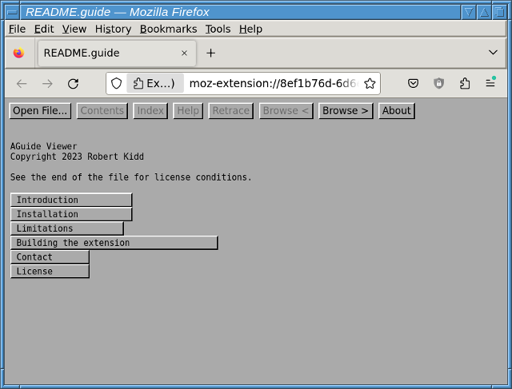

AGuide Viewer
Copyright 2023 Robert Kidd

See the end of the file for license conditions.

Introduction

AGuide Viewer is an open source reader for AmigaGuide documents implemented as a browser extension.  It works with Firefox* and Chromium* on all platforms.

* Tested on Windows and Linux

Installation

Firefox:
 - Download the release build [aguide-0.1.xpi](https://github.com/rkidd7952/aguide-viewer/releases/download/v0.1/aguide-0.1.xpi)
 - Tools > Add-ons
 - (Gear icon) > Install Add-on From File...
 - Choose aguide-0.1.xpi

Firefox (development build):
 - Browse to about:debugging#/runtime/this-firefox
 - Choose Load Temporary Add-on...
 - Load aguide.xpi or manifest.json

Chromium:
 - Unzip aguide.xpi
   mkdir aguide-unzipped
   cd aguide-unzipped
   unzip ../aguide.xpi
 - Choose More tools -> Extensions
 - Load aguide-unzipped as an unpacked extension
 
Usage

The extension installs hooks to detect downloads of files with a .guide filename extension or that start with the '@database' sequence.  AmigaGuide documents downloaded from the web are automatically rendered in the browser.

The extension supports viewing local files.  Open a local file using any method supported by the browser, entering a file:/// URL, use the File->Open menu option, or use the operating system's file manager to open a .guide file with the browser.

Alternatively, AGuide Viewer can be launched by clicking the AGV icon in the browser's toolbar.  The interface mimics that of the AmigaGuide or MultiView utilities.

Navigation buttons (Contents, Retrace, Browse) work as they do in the native Amiga readers.  The browser's native history commands also work as normal.

Limitations

Links from one AmigaGuide document to another may not work as expected when browsing local files in Firefox.  Firefox blocks direct links to local files from the extension.  To open such a link, right click, open the link in a new tab or window, then reload the new tab to render.

Building / Dependencies

The extension doesn't need to be built to test changes.  Follow the installation procedure above and select manifest.json or the directory that contains manifest.json, depending on browser.

Building the extension bundle requires the following packages.
 - make
 - zip

To build the extension bundle
 % make

Tagging and packaging the extension for distribution requires additional packages.
 - git
 - jq (https://stedolan.github.io/jq)

To tag and package for distribution
 % make dist VERSION=vers

Contact for bugs, patches, etc
Robert Kidd <robert.kidd@gmail.com>

License

AGuide Viewer is free software: you can redistribute it and/or modify it under the terms of the GNU General Public License as published by the Free Software Foundation, either version 3 of the License, or (at your option) any later version.

AGuide Viewer is distributed in the hope that it will be useful, but WITHOUT ANY WARRANTY; without even the implied warranty of MERCHANTABILITY or FITNESS FOR A PARTICULAR PURPOSE. See the GNU General Public License for more details.

You should have received a copy of the GNU General Public License along with AGuide Viewer. If not, see <https://www.gnu.org/licenses/>.
